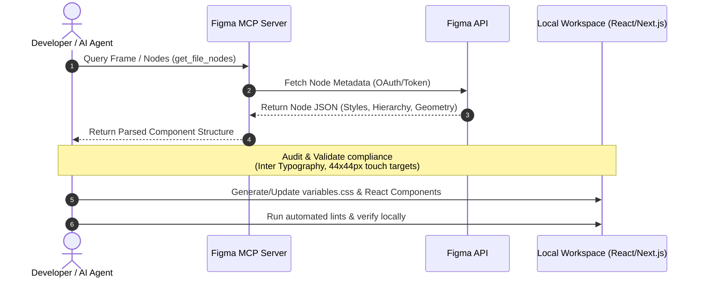

# MCP Figma Integration Strategy - Welo Platform SaaS

This document establishes the architecture, synchronization workflow, and component mapping strategy for connecting Figma designs to the React/Next.js frontend using the Model Context Protocol (MCP).

---

## 📐 Architecture & Synchronization Flow

The integration uses the Figma MCP server to read frames, components, and design styles, converting them into structured JSON metadata. This metadata is then parsed locally to update CSS tokens and component structures.



---

## 🎨 Figma Design Audit & Standards

Before components or tokens are synchronized, the Figma source frames must be audited to verify compliance with the project specifications.

### 1. Typography Inspection
- **Font Family:** Must use **Inter** exclusively. Any node utilizing secondary or system fonts must be flagged as a design deviation.
- **Font-Sizes:** Must conform to the standard typographic hierarchy:
  - `h1`: `36px` (`2.25rem`)
  - `h2`: `24px` (`1.5rem`)
  - `h3`: `18px` (`1.125rem`)
  - `Body`: `14px` (`0.875rem`)
  - `Small`: `12px` (`0.75rem`)

### 2. Touch Target & Mobile Usability Verification
- **Interactive Targets:** Every interactive element (buttons, tabs, inputs, dropdown items) must have a bounding box of at least **44x44px** in the Figma layout.
- **Spacing Guidelines:** A minimum of `8px` spacing must be defined between adjacent clickable nodes.

### 3. Responsive & Mobile-First Checks
- The design frame must specify dynamic layout grids (flex/grid behaviors) and list fluid constraints.
- Separate mobile (`320px-480px`) and desktop (`1200px+`) layouts must exist for all core screens to verify responsiveness.

---

## 📱 Mobile-First UI Synchronization Strategy

To ensure seamless implementation of user interfaces, Welo Platform enforces a structured synchronization workflow:

```
[Fetch Figma Nodes] ➔ [Extract Design Tokens] ➔ [Apply CSS Variables] ➔ [Generate Mobile-First Layout] ➔ [Extend for Desktop]
```

1. **Token Extraction:** Extract raw color scales and layout metrics from Figma variables.
2. **Translate to HSL:** Map HEX colors from Figma to standard CSS HSL custom properties inside `globals.css` or a dedicated `theme.css`.
3. **Draft Mobile CSS:** Write base styles targeting mobile viewports (widths under `768px`) using touch-friendly rules.
4. **Media Query Extension:** Add `@media (min-width: 1200px)` overrides for large screens. Never write desktop-first styling rules.

---

## 🧩 Component Mapping: Figma to React

Figma layers are mapped directly to Next.js components following strict modular guidelines:

| Figma Node Type | React Component Representation | Base CSS Class / Structure |
| :--- | :--- | :--- |
| `FRAME` (Layout Container) | `<div className="flex ...">` or `<section>` | Flexbox/Grid wrappers, padding, gap definitions |
| `TEXT` (Type Node) | `<h1>`, `<h2>`, `<p>`, or `<span>` | Conforms to Inter text sizes and line-heights |
| `INSTANCE` (Button, Input) | `<Button>` or `<Input>` (Shared UI) | Imported from global shared components library |
| `VECTOR` (Icons, Paths) | SVG Component / Inline React SVG | Rendered with native custom classes for sizing |

### Mapping Example
A Figma card frame named `ServiceCallCard` maps to:
```tsx
// src/modules/service_calls/components/ServiceCallCard.tsx
import React from 'react';

interface ServiceCallCardProps {
  title: string;
  status: 'pending' | 'in-progress' | 'completed';
}

export const ServiceCallCard: React.FC<ServiceCallCardProps> = ({ title, status }) => {
  return (
    <div className="flex flex-col p-4 border border-card-border bg-card-bg rounded-xl">
      <h3 className="font-sans text-sm font-medium text-foreground">{title}</h3>
      <span className={`badge-${status} text-xs font-semibold`}>{status}</span>
    </div>
  );
};
```

---

## 🔄 Token Management & Versioning

- **Sync Directory:** All synchronized tokens must be compiled into `app/globals.css` (or `src/styles/variables.css`).
- **No Direct Commits:** Auto-generated CSS from MCP must be reviewed and merged through a standard pull request. Direct pushes of synced files to production branches are forbidden.
- **Commit Format:** Commits modifying style variables must be prefixed with `ui:` (e.g. `ui: sync design tokens from figma frame #1423`).

---

## 💰 Scaling & Optimization Considerations

### Token & Cost Optimization
- **Node Filtering:** When executing Figma MCP commands, query specific Node IDs rather than fetching entire large Figma files. This reduces payload size and token consumption.
- **API Cache Strategy:** Cache Figma JSON responses locally during development to minimize redundant API calls and prevent hitting rate limits.

### Scaling & Technical Debt Risks
- **Over-Specification:** Avoid generating overly granular CSS classes (e.g. custom margins on every element). Rely on standard layout spacing tokens.
- **Manual Overrides:** Any manual tweak to React components that deviates from Figma design variables must be explicitly documented to prevent design-code drift.
