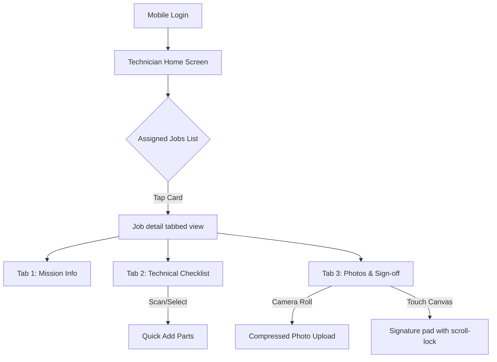

# Mobile Technician Experience Foundation - Welo Platform SaaS

This document establishes the Mobile Technician Experience Foundation for the Welo Platform. It audits the current technician user experience, identifies mobile-readiness gaps, and outlines a mobile-first architectural framework optimized for rapid, low-friction field operations under stressful, low-connectivity, and single-handed use-case environments.

---

## 1. Audit of Current Technician UX

An inspection of the active technician views (`/dashboard/service-calls` and `/dashboard/service-calls/[id]`) reveals several desktop-first patterns and field usability problems:

### 🔍 Identified Usability Gaps & Risks

* **Header Navigation Fatigue:** 
  - The mobile view relies on a desktop sidebar converted to a hamburger menu. A technician must open the menu and look through administrative categories ("Clients", "Inventaire", "Techniciens") that they rarely need on-site.
  - The details page header has secondary desktop actions (such as "Télécharger le PDF" and "Archiver") taking up primary header space.
* **Vertical Scroll Drift (Detailed View):**
  - Because Next.js collapses the 3-column layout into a single vertical stack, the updates section (Notes, Photos, Signature, Parts) is pushed to the bottom. A technician must scroll past the client card, machines lists, and chronological machine histories to record actions or obtain a client signature.
* **Accidental Action Triggers:**
  - The `ServiceCallCard` exposes a "Supprimer" (Delete) trash button to all users. In a field environment (wet hands, active environments), a technician could accidentally tap this button and delete a service call.
  - The status update dropdown is immediately adjacent to the client details link, increasing the risk of mis-taps.
* **Touch Target Violations (< 44px):**
  - Select inputs for Priority and Technician on the details page use standard form inputs with heights under `38px`, making them difficult to operate single-handed.
  - The "Supprimer la photo" (Delete Photo) button inside the photo gallery is positioned closely below the preview card, introducing click-collision risks.
* **Canvas Drawing Scroll Issues:**
  - The signature canvas in `SignatureSection.tsx` delegates to `react-signature-canvas` but lacks a dedicated page-scroll wrapper lock. On certain mobile browsers, touching the signature pad can accidentally trigger page-scroll bounce, causing incomplete or skewed signatures.
* **High Cognitive Density:**
  - The parts form requires entering "Nom de la pièce", "Quantité", and "Prix unitaire ($)" simultaneously. In the field, technicians need pre-configured parts lists or simple quantity click-counters rather than typing numerical currencies on standard keyboards.

---

## 2. Mobile-First Product Principles

To transform the Welo Platform into a premium mobile tool, all future mobile technician modules must adhere to the following principles:

### 🧠 Product Core Guidelines

* **Fast in the Field:** Minimize clicks to complete core tasks. Every screen must load instantly and respond to touch actions under `100ms` with optimistic UI updates.
* **Simple Under Stress:** Limit cognitive load by showing only **one primary action** per view (e.g. "Démarrer l'intervention" -> "Ajouter pièces/photos" -> "Faire signer" -> "Clore l'intervention").
* **Low-Friction Input:** Avoid free-form typing. Prefer large select buttons, toggle chips, scanning, and native calendar pickers.
* **One-Handed (Thumb-Zone) Navigation:** Position all interactive triggers in the bottom 40% of the screen.

### 📐 Mobile Interface Specifications

| Design Token | Mobile Value | Rationale |
| :--- | :--- | :--- |
| **Minimum Touch Target** | `48px x 48px` (`min-h-12`) | Exceeds WCAG 2.1 AA (`44px`) to protect wet/gloved finger inputs. |
| **Target Spacing** | `min-gap: 12px` | Prevents adjacent click collisions on small viewports. |
| **Viewport Base** | `320px` (min-width) | Safe rendering down to iPhone SE / legacy field devices. |
| **Readability Size** | `16px` (`text-base`) | Native input font size minimum to prevent iOS safari auto-zooming. |
| **Layout Gutters** | `16px` (`px-4`) | Standard side paddings to maximize readable canvas area. |

---

## 3. Proposed Dedicated Mobile Technician Architecture

We propose a streamlined, modular route structure designed specifically for mobile technician viewports:

### 🗺️ Screen Flow & Layout Specs

#### A. Technician Home Screen (`/mobile/technician`)
* **Layout:** Top bar showing technician profile state (Online/Offline) and an offline synchronization badge. Center displays the "Current Active Job" pinned at the top.
* **Actions:** Large call-to-action button to navigate to active interventions, and a bottom navigation bar.

#### B. Assigned Calls List (`/mobile/technician/jobs`)
* **Layout:** Vertical card list sorted chronologically by priority. 
* **Filter bar:** Sticky segment controller filter chips: `À faire` (Assigned/On the way), `En cours` (On site), `Terminés`.
* **Card Design:** Restricted to Client name, address, machine code, and a primary CTA "Démarrer la route". **No delete button.**

#### C. Service Call Detail Page (`/mobile/technician/jobs/[id]`)
* **Layout:** Tabbed interaction panel instead of a vertical scroll stack:
  1. **Fiche:** Location, client information, GPS launcher, description.
  2. **Intervention:** Notes textarea, machine checklists, parts consumed.
  3. **Clôture:** Photo attachments and client signature drawing pad.
* **Navigation:** Back button always visible. Sticky bottom toolbar containing the single next logical action (e.g. "Arrivé sur site").

#### D. Bottom Navigation component (`MobileBottomNavigation`)
* **Tab 1: Missions** (Jobs list)
* **Tab 2: Stock** (Technician's local van inventory lookup)
* **Tab 3: Historique** (Past 30 days completed jobs)

---

## 4. Feature Flow Standard Operating Procedures

### 📍 GPS Launch Integration
* **Trigger:** A single "Itinéraire" (Get Directions) button next to the address on the job details card.
* **Behavior:** Detects mobile OS to launch native navigation apps:
  - iOS: `maps://maps.apple.com/?daddr={address}`
  - Android/Fallback: `https://www.google.com/maps/dir/?api=1&destination={address}`

### 📸 Low-Bandwidth Photo Upload Flow
1. Technician taps the camera card icon (`PhotosSection`).
2. Opens native camera view using `accept="image/*;capture=camera"`.
3. Captured image blob is processed client-side:
   - Resized to max 1280px width/height.
   - Compressed via canvas to JPEG format under 400KB.
4. Optimistic thumbnail rendered immediately with a spinner.
5. Pushed to storage bucket. Retries automatically if connection is unstable.

### ✍️ Scroll-Locked Client Signature Flow
1. Tapping "Faire Signer" opens a modal overlay locking the main page scroll (`overflow: hidden` on body).
2. Canvas renders with touch drawing handlers active.
3. Coordinates scale using `window.devicePixelRatio`.
4. Buttons "Effacer" (Clear) and "Enregistrer" (Save) are placed at opposite corners (minimum 16px separation) to prevent accidental wipes.
5. On save, image converts to base64, saves to indexedDB cache, and attempts background synchronisation.

### 🏁 Low-Friction Closure Flow
* **Visual Checklist Validation:** Prevents closing if photos or signature are missing (visual warnings).
* **Single Action:** Bottom sticky button displays "Terminer l'intervention".
* **Success Feedback:** Renders a clean success animation and returns the technician to their active jobs list.

---

## 5. Audit of Existing Components for Mobile Readiness

| Component | Current Mobile Readiness | Identified Risks | Future DS Primitive Requirement |
| :--- | :--- | :--- | :--- |
| **`DSCard`** | High | Padding can be tight on some viewport configurations. | Variant "flat" needs standard padding mappings for inner elements. |
| **`DSInput` / `DSSelect`** | Medium | Tap targets are sometimes under `40px` inside complex layout forms. | Introduce unified mobile sizing variables (`--touch-target-min`). |
| **`PhotosSection`** | Medium | Large delete buttons increase horizontal layout wrapping complexity. | Compact trash icon buttons positioned away from preview hotspots. |
| **`PartsSection`** | Low | Requires text-input fields for names and numbers on mobile. | Implement quantity counters (`+` / `-`) and searchable auto-suggest. |
| **`SignatureSection`** | Medium | Resizing canvas can clear signature state if phone rotates. | Layout lock or automatic coordinate rotation scaling. |
| **`DashboardShell`** | Low | Sidebar takes space and hamburger menu causes cognitive overload. | Replaced by a dedicated `MobileBottomNavigation` for technicians. |

---

## 6. Recommended Priorities & Implementation Roadmap

We recommend executing the mobile technician experience modernization in three progressive phases:

### Phase 1: High-Priority Touch & Layout Refinements (Visual-Only)
* **Action:** Replace text-heavy inputs in `PartsSection` with tactile form controls.
* **Action:** Restrict "Delete Call" action on `ServiceCallCard` to non-technician roles.
* **Action:** Implement body scroll locking during drawing on `SignatureSection`.

### Phase 2: Dedicated Technician Mobile Shell
* **Action:** Introduce `/mobile/technician` routes.
* **Action:** Consume `MobileBottomNavigation` to bypass the desktop sidebar entirely.
* **Action:** Group detail page contents into tabbed interfaces to eliminate vertical scrolling.

### Phase 3: Offline Resilience & Tactile Enhancements
* **Action:** Integrate background synchronization queue for offline status changes.
* **Action:** Hook up local storage caching using `OfflineSyncIndicator`.
* **Action:** Add GPS app launcher and native camera compression helpers.
