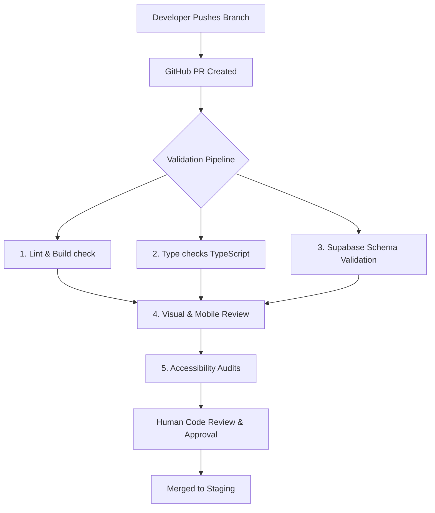
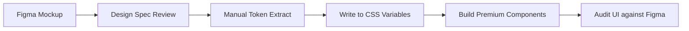

# Welo Platform Operational Workflow System

This operational system defines how software engineering, design, database management, and AI agents collaborate on the Welo Platform SaaS product.

---

## 1. Branch Strategy & Naming Conventions

To keep rapid iterations clean, we use standard, documented naming conventions.

### Branch Categories & Prefixes
Branches must be prefixed based on the type of work being performed:
- **`feature/`**: Development of new features or user capabilities (e.g., `feature/dispatch-board-v2`).
- **`bugfix/`**: Standard bug fixes and error corrections (e.g., `bugfix/completed-status-overflow`).
- **`hotfix/`**: Urgent fixes applied directly to production/staging issues (e.g., `hotfix/session-expiry-crash`).
- **`db/`**: Database migrations, RLS adjustments, or seed additions (e.g., `db/machine-history-rpc`).
- **`ui/`**: CSS modifications, layout polishes, and asset integration (e.g., `ui/kanban-glassmorphism`).
- **`mobile/`**: Responsive styling fixes and offline sync features (e.g., `mobile/offline-sync`).
- **`ai/`**: AI script integrations and subagent task logs (e.g., `ai/report-summary-generation`).
- **`refactor/`**: Code restructuring, optimization, and tech debt reduction (e.g., `refactor/service-call-modules`).
- **`docs/`**: Documentation updates, README changes, or wiki logs (e.g., `docs/operational-workflow-init`).

### Branching Rules
1. **Source:** Always branch off of the `staging` branch (or `main` if hotfixing).
2. **Merge Path:** Local branch ➔ Pull Request ➔ `staging` ➔ Release Tag ➔ `main` (Production).

---

## 2. Environment Architecture

We maintain four distinct environments to balance safety and speed.

| Environment | Purpose | Database | Deployment Trigger | URL Pattern |
| :--- | :--- | :--- | :--- | :--- |
| **Local** | Sandbox for active development | Local container / personal schema | Manual local spinup | `localhost:3000` |
| **Preview** | Validate branch changes / PR preview | Staging database (read-only / isolated) | Vercel PR branch build | `*-preview.vercel.app` |
| **Staging** | Final QA, integration tests, and seed checks | Mirror of production schema | Push to `staging` branch | `staging.welo.app` |
| **Production** | Live user access and services | Production (Strict RLS, backups enabled) | Release tags / manual release | `app.welo.app` |

---

## 3. Pull Request (PR) Validation Sequence

Every PR must pass through a strict validation sequence before it can be merged into `staging`.

### Future GitHub Actions CI/CD Roadmap
We are preparing the architecture for a fully automated GitHub Actions pipeline. For now, the structure is detailed in [ci.yml](file:///c:/Users/Dylan/Documents/welo_platform/.github/workflows/ci.yml) and the pipeline includes:
1. **Build Validation:** Run `npm run build` on the branch to catch bundler bugs.
2. **Linter Execution:** Run `npm run lint` to enforce formatting and import rules.
3. **TypeScript Integrity:** Verify type compliance using `tsc --noEmit`.
4. **Supabase Schema Validation:** Run the Supabase CLI validator to verify that migration files do not conflict or break existing relationships.
5. **Accessibility (a11y) & Responsive Checks:** Run automated Axe audits on preview deployments.

---

## 4. Design-to-Code Workflow

Establishing design integrity ensures the user interface feels premium, polished, and state-of-the-art.

### Design System Sync Checklist
- [ ] **Figma Frame Approved:** Ensure the UI frame has a "Ready for Dev" status in Figma Dev Mode.
- [ ] **Verify Colors:** Map Figma color variables to CSS Custom Properties inside `src/styles/variables.css` or `index.css`.
- [ ] **Variant Sync:** Confirm component variants (e.g., hover, focus, disabled, active) have matching CSS transition definitions.
- [ ] **Responsive Specs:** Ensure the Figma layout specifies fluid margins, flex wraps, and tablet/mobile configurations.

### Component Release & Versioning Strategy
- **Local Components:** Contained within the modules folder (e.g., `src/modules/service_calls/components/`).
- **Shared UI Components:** Promoted to the global component directory once they are verified in at least two separate modules.
- **Component Versioning:** Since Welo is currently a single-repo project, we track changes using atomic Git commits. Future component library extractions will adopt semantic versioning (`semver`).

### Future Monorepo Readiness Guidelines
1. **Module Isolation:** Ensure modules do not import directly from other modules. All sharing must happen through interfaces, services, or a common global folder.
2. **Workspace Independence:** Keep Next.js pages isolated from backend business logic where possible, preparing the structure to be split into:
   - `apps/welo-web` (Frontend Next.js app)
   - `packages/database` (Supabase schema and migrations)
   - `packages/ui` (Shared React components)

---

## 5. Supabase Safety Workflow

Database safety is paramount to prevent data loss or security leaks in Welo Platform.

### 🛡️ Database Governance Process

1. **Migration Creation:**
   - Create migrations locally using the Supabase CLI (`supabase migration new <name>`) or write them inside the repository root (e.g., [supabase_completed_status_fix.sql](file:///c:/Users/Dylan/Documents/welo_platform/supabase_completed_status_fix.sql)).
   - Do **NOT** run migrations directly on staging or production database instances.

2. **Row Level Security (RLS) Rules:**
   - Every table must have RLS enabled (`ALTER TABLE <name> ENABLE ROW LEVEL SECURITY;`).
   - RLS policies must restrict writes to authorized users (e.g., matching technician or dispatcher IDs).
   - Any PR containing a schema change must undergo a dedicated **RLS validation check** to ensure no open tables are exposed to the public.

3. **Rollback Preparation:**
   - Every migration file must have a corresponding rollback SQL script documented in the pull request.
   - The rollback script must drop newly added tables/columns and restore modified trigger behaviors.

4. **Seed Data Strategy:**
   - Use `supabase_seed_data.sql` to populate development schemas.
   - Production seed data must only consist of static config records (e.g., list of service categories). Never insert fake or demo users in production.

---

## 6. AI Execution Workflow

We utilize the Antigravity AI agent to accelerate development while ensuring safety.

### 🤖 Autonomy & Human Boundaries

#### 🟢 Autonomous Actions (Allowed without asking)
- Researching code symbols, imports, and component trees.
- Writing unit tests and utility function logic.
- Adding styling polishes, CSS variables, and layout adjustments to local component files.
- Modifying non-production, non-security files.

#### 🟡 Human Approval Required (STOP and ask)
- Creating new backend routes or API schemas.
- Adding third-party NPM packages.
- Modifying configurations that alter global tools or the bundler (e.g., `next.config.ts`, `tsconfig.json`).
- Committing major changes to core state handlers or dispatch routing logic.

#### 🔴 Forbidden Actions (Never execute)
- Running database migrations on staging or production.
- Deleting production data or dropping tables.
- Pushing code directly to the `main` or production deployment branches.
- Hardcoding API keys or storing authentication tokens in the code repository.

### 📝 Required Documentation Updates
- Any change to the database must be registered in the project README or schema logs.
- Any tool modification must be documented in [MCP_SETUP_CHECKLIST.md](file:///c:/Users/Dylan/Documents/welo_platform/MCP_SETUP_CHECKLIST.md).
- The agent must always summarize its actions in [walkthrough.md](file:///C:/Users/Dylan/.gemini/antigravity-ide/brain/aa84cd25-f11c-4d77-b65a-916aa0b8f429/walkthrough.md) at the end of its work.
